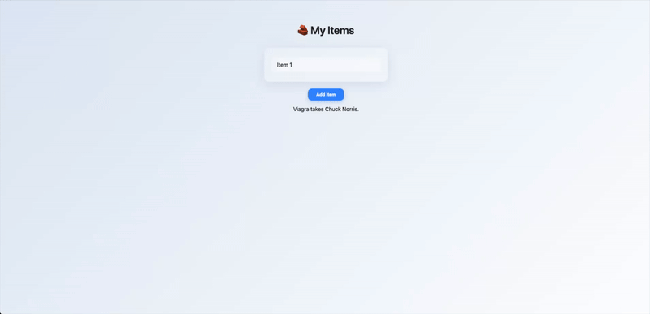
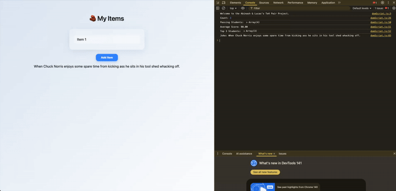

# 🎨 te4-js-pair-lab-abinash-lucas

---

💡 Challenge Tasks

- 🧩 Part 1 – Functions & Closures
  
- 🧮 Part 2 – Arrays Deep Dive
  
- 🧱 Part 3 – DOM Manipulation
  
- 🌐 Part 4 – Async JS + JSON + APIs
  
- 🧰 Part 5 – Error Handling & Debugging

---

## 💻 Built With


---

## 🎬 Demo
### Page View


### Page View with Console


---

## 🚀 How to Run
```bash
git clone https://github.com/yourusername/te4-js-pair-lab-abinash-lucas.git
cd te4-js-pair-lab-abinash-lucas
open index.html
